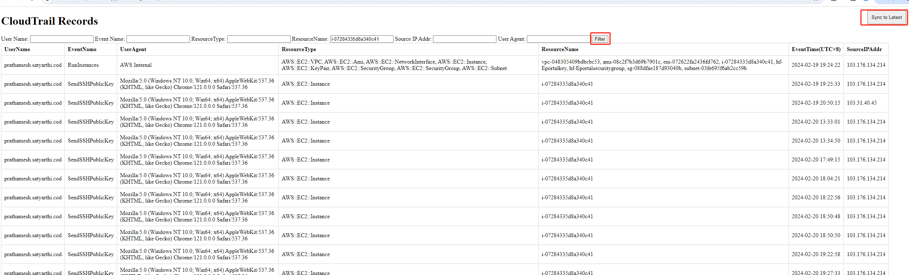

# awscloudtrail
0. We need an access key to login to AWS cloud, for more detail review AWS_setting.read

1. create a mysql DB server, install django, Python:3.9.18, django:4.2.8 , mysql: 8.0

2. Mysql8.0: database name should be 'cloudtrailrecord', cotains 2 tables: <br>
    'cloudtrailcndev' & 'cloudtrailcnprod'. reference to cloudtrailapp/models.py<br>
    config awscloudtrail/settings.py:  (this config define database in settings.py)
    ```json
    DATABASES = {
        "default": {
            "ENGINE": "django.db.backends.mysql",
            "NAME": "cloudtrailrecord",
            "USER": "root",
            "PASSWORD": "111111",
            "HOST": "localhost",
            "PORT": "3306",
        }
    } 


3. modify cloudtrailapp/models.py:
    <pre>
    ```python
    from django.db import models

    class CloudTrailRecord(models.Model):
        UserName = models.CharField(max_length=30)
        EventName = models.CharField(max_length=50)
        UserAgent = models.CharField(max_length=200)
        ResourceName = models.CharField(max_length=200)
        ResourceType = models.CharField(max_length=200)
        EventTime = models.DateTimeField()
        sourceIPAddr = models.GenericIPAddressField()

        def __str__(self):
            return f"{self.EventName} by {self.UserName} on {self.EventTime}"

        class Meta:
            abstract = True

    class CloudTrailCndevRecord(CloudTrailRecord):
        class Meta:
            db_table = "cloudtrailcndev"
            app_label = "cloudtrailapp"

    class CloudTrailCnprodRecord(CloudTrailRecord):
        class Meta:
            db_table = "cloudtrailcnprod"
    
    ```
    </pre>

4. database Feature with these fields, currently we have 2 tables regarding to cndev & cnprod:<br>
    UserName<br>
    UserAgent<br>
    EventName<br>
    EventType<br>
    EventTime<br>
    sourceIPAddr<br>

5. Generate database and tables in Django by terminal: <br>
   python manage.py makemigrations <br>
   python manage.py migrate

6. Start django: <br>
   python manage.py runserver

7. open web link: <br>
   http://127.0.0.1:8000/cloudtrailapp/cloudtrail_records/cndev/ <br>
   http://127.0.0.1:8000/cloudtrailapp/cloudtrail_records/cnprod/

8. sync to latest use a timestamp, file location: cloudtrailapp/timeStamp/Lastcndev.txt & Lastcnprod.txt<br>
    This timestamp is the start timestamp , and when finish syncing timestamp will be: <br>
    current.timstamp - 310s

