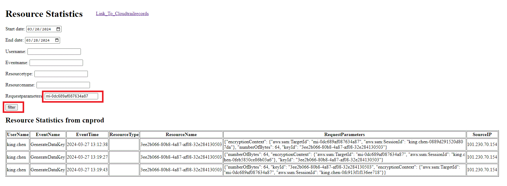

# awscloudtrail 
These codes used for downloading cloudtrail data from AWS saved into mysql database.<br>
In browser, user can quickly filter event information based on certain field content and trace related log details.<br>

0. We need an access key to login to AWS cloud, for more detail review **AWS_setting.read**

1. create a mysql DB server, install django, Python:3.9.18, django:4.2.8 , mysql: 8.0

2. Mysql8.0: database name should be 'cloudtrailrecord', cotains 2 tables: <br>
    'cloudtrailcndev' & 'cloudtrailcnprod'. reference to cloudtrailapp/models.py<br>
    config awscloudtrail/settings.py:  (this config define database in settings.py)
    ```json
    DATABASES = {
        "default": {
            "ENGINE": "django.db.backends.mysql",
            "NAME": "cloudtrailrecord",
            "USER": "root",
            "PASSWORD": "111111",
            "HOST": "localhost",
            "PORT": "3306",
        }
    } 


3. modify cloudtrailapp/models.py with the table name you want, one table corresponds to one AWS environment:
    <pre>
    ```python
    from django.db import models

    class CloudTrailRecord(models.Model):
        UserName = models.CharField(max_length=30)
        EventName = models.CharField(max_length=50)
        UserAgent = models.CharField(max_length=200)
        ResourceName = models.CharField(max_length=200)
        ResourceType = models.CharField(max_length=200)
        EventTime = models.DateTimeField()
        sourceIPAddr = models.GenericIPAddressField()
        RequestParameters = models.CharField(max_length=2000, blank=True)

        def __str__(self):
            return f"{self.EventName} by {self.UserName} on {self.EventTime}"

        class Meta:
            abstract = True

    class CloudTrailCndevRecord(CloudTrailRecord):
        class Meta:
            db_table = "cloudtrailcndev"
            app_label = "cloudtrailapp"

    class CloudTrailCnprodRecord(CloudTrailRecord):
        class Meta:
            db_table = "cloudtrailcnprod"
            app_label = "cloudtrailapp"
    ```
    </pre>

4.  We have 1 database with 2 tables regarding to cndev & cnprod, each table contains these fields:<br>
    field 'UserName'<br>
    field 'UserAgent' used in view 'CloudTrail Records'<br>
    field 'EventName'<br>
    field 'ResourceName'<br>
    field 'ResourceType'<br>
    field 'EventTime'<br>
    field 'sourceIPAddr'<br>
    field 'RequestParameters' used in view 'Resource Statistics'<br>

5. Generate database and tables in Django by terminal: <br>
   python manage.py makemigrations <br>
   python manage.py migrate

6. Start django: <br>
   python manage.py runserver

7. open web link<br>
   Get all data from database:<br>
   http://127.0.0.1:8000/cloudtrailapp/cloudtrailrecords/cndev/ <br>
   http://127.0.0.1:8000/cloudtrailapp/cloudtrailrecords/cnprod/ <br>
   Filter data which user use AWS resource through DateTime and UserName field:<br>
   http://127.0.0.1:8000/cloudtrailapp/resource/cndev/ <br>
   http://127.0.0.1:8000/cloudtrailapp/resource/cnprod/ <br>

8. Button 'sync to latest' use timestamp, file location: cloudtrailapp/timeStamp/Lastcndev.txt & Lastcnprod.txt<br>
   Timestamp in file is used as start timestamp, after finishing sync, new timestamp will be replaced into file:<br>
   Replaced_timestamp = (timstamp_of_current_time - 310)<br>

<br>

<br>